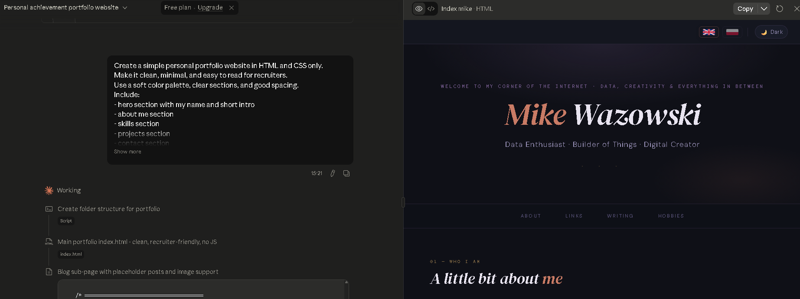
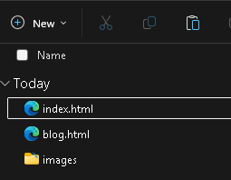
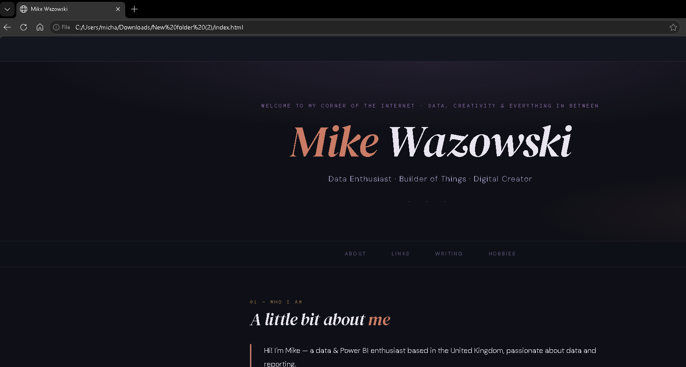
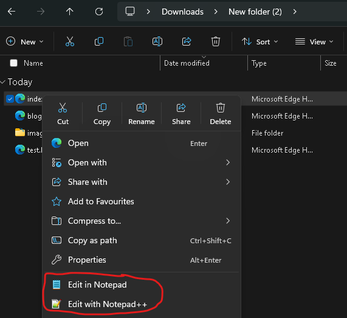
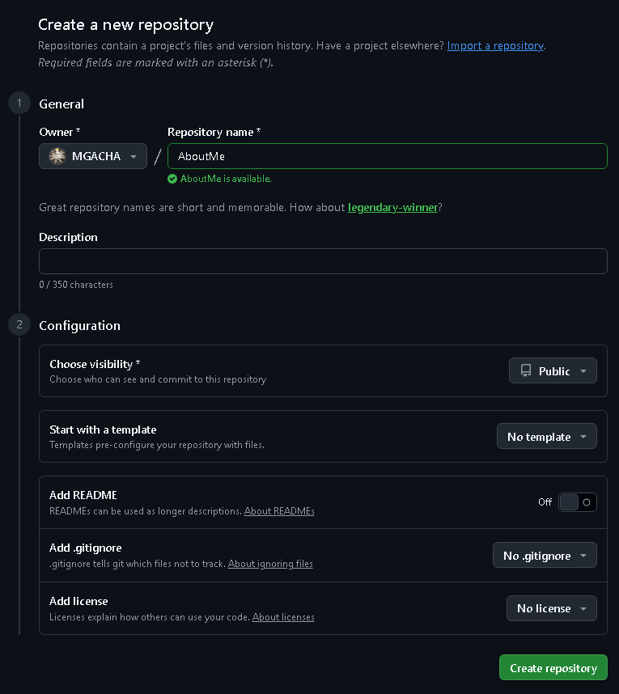
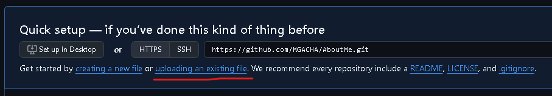
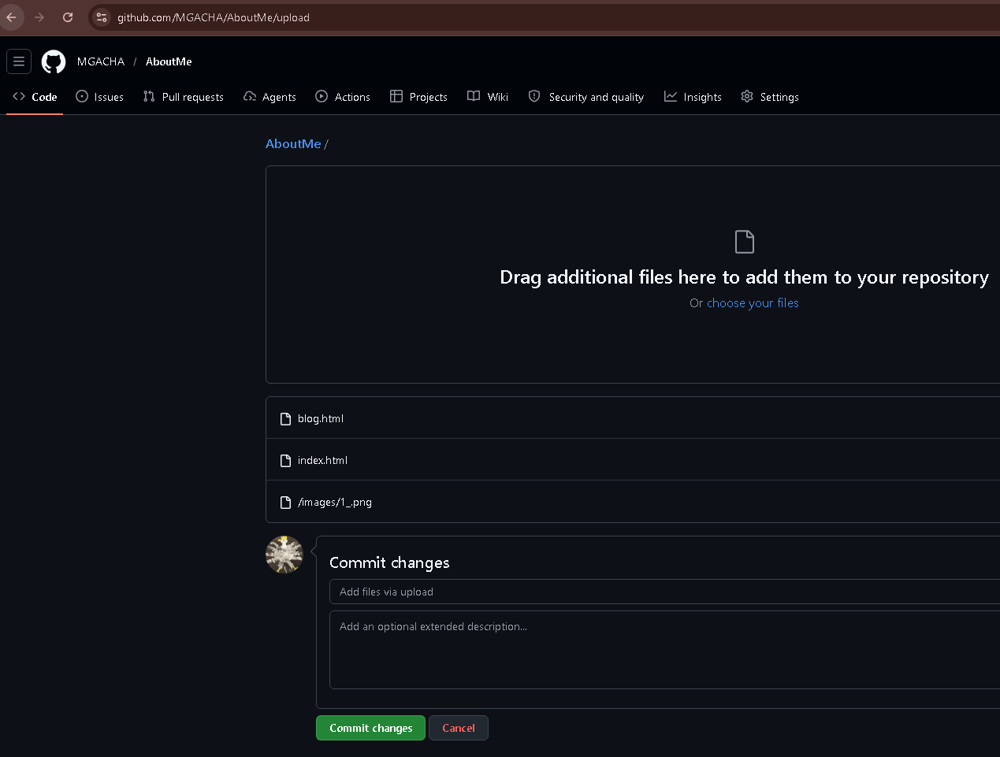
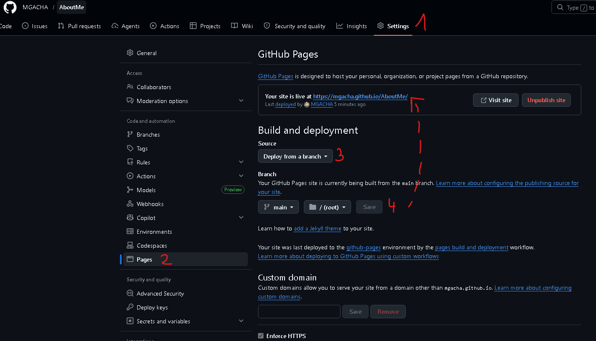
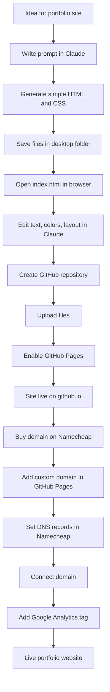

# How I built my Portfolio Website in 3 evenings with a low budget

This article explains, step by step, how a simple portfolio website can be created with very little money and without software developer experience. GitHub Pages can publish static files such as HTML and CSS, it looks for a main file like `index.html`, and publishing can take up to 10 minutes after changes are saved. [GitHub](https://docs.github.com/en/pages/getting-started-with-github-pages/what-is-github-pages). A custom domain can also be connected, but GitHub recommends adding the custom domain in repository settings before finishing the DNS setup with the domain provider.[YT](https://www.youtube.com/watch?v=VRgTYJyN9pg)

I built my website in:

- simple HTML and CSS,
- with help from AI prompts (Cloude),
- hosted it for free using GitHub Pages,
- connected my own domain from Namecheap,
- added HTTPS,
- and connected Google Analytics.

## Why this project mattered

A personal portfolio website does not need to be expensive or technically complicated. In this case, the only direct cost was the domain name, while GitHub Pages provided hosting for the website files.[GitHub](https://docs.github.com/en/pages/configuring-a-custom-domain-for-your-github-pages-site/managing-a-custom-domain-for-your-github-pages-site). The whole project took three evenings and was built with simple files that could be opened and edited from a normal desktop folder.

This approach is useful for people who are not developers but are comfortable reading simple lines of code (and even that is not necessary). A static site built with HTML and CSS is a good choice because it is light, fast, and easier to understand than a full web application.

## The idea behind the website

The goal was to build a website that looked clean, simple, and easy to read. Instead of using complex tools, the site was created with HTML for the structure and CSS for the styling. GitHub Pages is designed for static content and does not support server-side languages such as PHP or Python, which keeps the setup simpler for portfolio websites.

This also meant the site was easier to edit later. Text, headings, buttons, and page sections could be changed inside the HTML file, while colors, spacing, and fonts could be changed in the CSS file.

## The prompt used in Claude

[Claude](https://claude.ai/) was used as a helper to generate the first version of the website. The important part was to ask for something simple, readable, and easy to edit later.

Example prompt:

```text
Create a simple personal portfolio website in HTML and CSS only.
Make it clean, minimal, and easy to read for recruiters.
Use a soft color palette, clear sections, and good spacing.
Include:
- hero section with my name and short intro
- about me section
- skills section
- projects section
- contact section
- buttons for blog, LinkedIn, GitHub and YouTube

Important:
- keep the layout simple and responsive
- do not use JavaScript
- use plain HTML and CSS only
- make the code easy to understand and easy to edit by a non-developer
- add comments to show where each section starts
- create an index file as the main file,
- create blog file as a sub page (under blog button)
- create an image file where the images from the blog post will be stored
```


Also, I added a summary about myself without including true phone numbers, email address, links etc. I can edit that later in the `index.html` file.

This kind of prompt helps because it sets clear limits. Asking for HTML and CSS only makes the result easier to read, test, and change later.



## Step 1: Create the website files

The first step was to ask Claude to generate the website code. That code was then copied into simple files saved on a computer.

A basic folder structure looked like this:

```text
portfolio-website/
│
├── index.html
├── blog.html
└── images/
```


The most important file was `index.html`, because GitHub Pages uses a main file such as `index.html`, `index.md`, or `README.md` as the entry point of the website. For a simple portfolio site, `index.html` is the easiest option.

Simple example HTML:

```html
<!DOCTYPE html>
<html lang="en">
<head>
  <meta charset="UTF-8">
  <meta name="viewport" content="width=device-width, initial-scale=1.0">
  <title>Mike Wazowski</title>
  <link rel="stylesheet" href="style.css">
</head>
<body>
  <header>
    <h1>Mike Wazowski</h1>
    <p>Data Analyst | Portfolio Website</p>
  </header>

  <section>
    <h2>About Me</h2>
    <p>A short introduction about you.</p>
  </section>

  <section>
    <h2>Projects</h2>
    <p>Project examples go here.</p>
  </section>
</body>
</html>
```

Simple example CSS:

```css
body {
  font-family: Arial, sans-serif;
  margin: 0;
  padding: 0;
  background: #f7f8fb;
  color: #222;
}

header {
  background: white;
  padding: 40px;
  text-align: center;
}

section {
  max-width: 900px;
  margin: 30px auto;
  padding: 20px;
  background: white;
  border-radius: 10px;
}
```
What is HTML and CSS?

HTML is the structure of the website.
It creates:
- headings,
- paragraphs,
- buttons,
- sections,
- images.

Think of it like the skeleton of the page.

CSS controls the design and appearance.
It changes:
- colors,
- spacing,
- fonts,
- layouts,
- responsiveness for mobile devices.

Think of it like the decoration and styling.

## Step 2: Open the website from a desktop folder

Before uploading anything online, the website can be tested directly from a folder on the desktop. Opening the `index.html` file in a browser makes it possible to view the site locally and check how it looks.


This is a very beginner-friendly step because there is no pressure and no hosting needed yet. A file can be edited (in notepad or notepad++), saved, and refreshed in the browser again and again until the page looks right.


This is also a practical way to learn. Small changes in the HTML file show how text and page structure work, while small changes in the CSS file show how style, color, spacing, and layout work.

## Step 3: Create a GitHub repository

Once the local version looked good, the next step was to create a repository on GitHub. GitHub explains that a Pages site can be created from a new or existing repository, and that a user or organization site must use the name `<user>.github.io` or `<organization>.github.io`.[GitHub](https://docs.github.com/en/repositories/creating-and-managing-repositories/creating-a-new-repository)

For many beginners, this is the easiest path:

- Create a new repository.
- Upload the website files.
- Make sure `index.html` is in the correct location
- Add a README if desired.

Create repository - make sure this is public, not private.



This part matters because GitHub Pages needs the files to exist inside the repository before anything can be published.

## Step 4: Upload the files to GitHub

The website files can be uploaded directly through the GitHub website or with a desktop tool such as GitHub Desktop. For a simple portfolio website, direct browser upload is often enough.

The key detail is that the publishing source must include the website files and especially `index.html`. If the site is published from the root folder, that file must be there. If it is published from `/docs`, then the file must be inside `/docs`.

Upload or drag and drop new files `index.html`, `blog.html` and a folder for images and then hit Commit changes




## Step 5: Turn on GitHub Pages

After the files are in the repository, GitHub Pages can be enabled. GitHub says publishing can happen from a branch, usually `main`, and the source can be the root folder or the `/docs` folder on that branch.

Basic steps:

1. Open the repository.
2. Go to **Settings**.
3. Open **Pages**.
4. In **Build and deployment**, choose **Deploy from a branch**.
5. Select the branch, usually `main`.
6. Select the folder, usually `/root`.
7. Click **Save**.



After that, the site is deployed and becomes public. GitHub notes that publishing changes can take up to 10 minutes, so it may not appear instantly.
Now I have a GitHub portfolio page on my GitHub account. I can leave it as it is, or I can buy a domain and build it further.


[YouTube - Create repo and Git Hub Page](https://youtu.be/uQbRW36oohc)


## Step 6: Buy a domain on [Namecheap](http://namecheap.com/)

Once the site worked on the default GitHub Pages address, a custom domain could be purchased. In this project, that was the only paid part.

A custom domain gives a portfolio website a more personal and professional look. GitHub supports the use of custom domains for Pages websites, so a domain bought from a provider like Namecheap can be connected to the site.

## Step 7: Add the custom domain in GitHub first

This step is very important. GitHub recommends adding the custom domain in the repository settings before changing DNS records at the domain provider, because doing the DNS first can create a security risk.[How To Connect Namecheap Domain To GitHub Pages (Step By Step)](https://www.youtube.com/watch?v=_RpIr6yKcZo)

Basic steps:

1. Open the repository.
2. Go to **Settings**.
3. Open **Pages**.
4. In **Custom domain**, enter the domain name.
5. Click **Save**.[cite:4]

GitHub explains that when publishing from a branch, this action creates a `CNAME` file in the source branch, which helps connect the site to the domain. This was explained in the video [How To Connect Namecheap Domain To GitHub Pages (Step By Step)](https://www.youtube.com/watch?v=_RpIr6yKcZo)

## Step 8: Set DNS records in [Namecheap](http://namecheap.com/)

After the custom domain is added to GitHub, the DNS records can be configured in Namecheap. GitHub explains that the setup depends on whether the root domain, such as `example.com` is being used, or a subdomain such as `www.example.com`.

For an apex domain, GitHub recommends `A` records that point to these IP addresses:
[Configuring a custom domain for your GitHub Pages site](https://docs.github.com/en/pages/configuring-a-custom-domain-for-your-github-pages-site)

Check this on the GitHub website [Configuring an apex domain](https://docs.github.com/en/pages/configuring-a-custom-domain-for-your-github-pages-site/managing-a-custom-domain-for-your-github-pages-site#configuring-an-apex-domain)
- `185.199.108.153`
- `185.199.109.153`
- `185.199.110.153`
- `185.199.111.153`

For the `www` version, GitHub recommends a `CNAME` record pointing to `USERNAME.github.io` or `ORGANIZATION.github.io`, without the repository name.[cite:4]

Example DNS setup:

| Record type | Host | Value |
|---|---|---|
| A Record | @ | 185.199.108.153  |
| A Record | @ | 185.199.109.153  |
| A Record | @ | 185.199.110.153  |
| A Record | @ | 185.199.111.153  |
| CNAME Record | www | yourusername.github.io [Configuring an apex domain and the www subdomain variant](https://docs.github.com/en/pages/configuring-a-custom-domain-for-your-github-pages-site/managing-a-custom-domain-for-your-github-pages-site#configuring-an-apex-domain-and-the-www-subdomain-variant) |

GitHub also notes that DNS changes may take up to 24 hours to propagate, and it recommends avoiding wildcard DNS records because of security risks.
Alternatively chcek on [DNS Checker](https://dnschecker.org/)

## Step 9: Add Google Analytics - if desired

After the website is live, Google Analytics 4 can be added to track visits and user activity. Google’s setup flow starts with creating a property, then a web data stream, and then adding the Google tag to the website code. [How to Easily Add Google Analytics to a Website](https://www.youtube.com/watch?v=A2Z1mvGJUqM)

Simple beginner steps:

1. Log in to Google Analytics.
2. Go to **Admin**.
3. Create a new property.
4. Create a **Web** data stream.
5. Copy the Google tag.
6. Paste the tag into the `<head>` section of the HTML file.

Because the site uses plain HTML, this step is quite manageable. The code is simply added inside the page head section, then the file is saved and uploaded again.

Example position:

```html
<head>
  <meta charset="UTF-8">
  <meta name="viewport" content="width=device-width, initial-scale=1.0">
  <title>My Portfolio</title>
  <link rel="stylesheet" href="style.css">

  <!-- Google tag goes here -->
</head>
```
[YT](https://youtu.be/mlCX7RfTJ9U)

## What made this possible without developer skills

This project shows that full software developer knowledge is not always required to launch a small personal website. A beginner can get far with a clear AI prompt, basic patience, and the ability to read and update simple code.

The main reasons this worked were:

- the website stayed static, with HTML and CSS only
- the first version was generated with AI
- the site was tested locally before being uploaded
- GitHub Pages handled the hosting of static files
- the only financial cost was the domain name

## Common mistakes to avoid

A few mistakes can slow the project down:

- Missing `index.html`, or putting it in the wrong folder, because GitHub Pages needs the main file in the publishing source.
- Choosing the wrong branch or wrong folder in the Pages settings.
- Entering incorrect DNS records when connecting the custom domain.
- Expecting everything to work instantly, even though GitHub says publishing can take up to 10 minutes and DNS changes can take up to 24 hours.
- Configuring DNS before adding the custom domain in GitHub, even though GitHub recommends the opposite for security reasons.

## Website lifecycle diagram

A simple text flow:



## Useful links
- [YouTube - Create repo and Git Hub Page](https://youtu.be/uQbRW36oohc)
- [GitHub Pages: Creating a site](https://docs.github.com/en/pages/getting-started-with-github-pages/creating-a-github-pages-site)
- [GitHub Pages: Configure publishing source](https://docs.github.com/en/pages/getting-started-with-github-pages/configuring-a-publishing-source-for-your-github-pages-site)
- [GitHub Pages: Custom domain](https://docs.github.com/en/pages/configuring-a-custom-domain-for-your-github-pages-site)
- [GitHub Pages: Managing custom domain](https://docs.github.com/en/pages/configuring-a-custom-domain-for-your-github-pages-site/managing-a-custom-domain-for-your-github-pages-site)
- [GitHub Pages: HTTPS](https://docs.github.com/en/pages/getting-started-with-github-pages/securing-your-github-pages-site-with-https)
- [YouTube - How To Connect Namecheap Domain To GitHub Pages (Step By Step)](https://www.youtube.com/watch?v=_RpIr6yKcZo)
- [Google Analytics setup](https://support.google.com/analytics/answer/9304153?hl=en)
- [YouTube - Edit code in GitHub Repository for Google Analytics](https://youtu.be/mlCX7RfTJ9U)
